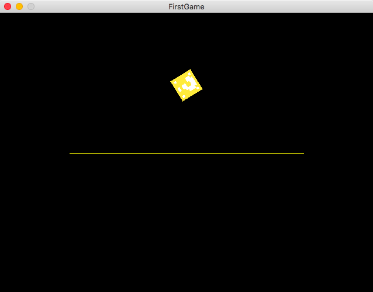

# Box2D in SDL2

A small Demo of Box2D using the Render-API from SDL2.

  

## Building

### Mac
Before building you need Box2D installed on your mac - you can do this using macports:

``sudo port install box2d``

This project was built using Xcode 9.3 on MacOSX 10.13 High Sierra - you can find the project file under ``Applications/FirstGame/Box2D_SDLDemo.xcodeproj``.
You can open it up and build it yourself.

### Linux, Windows
The source code (a single main.cpp) is located under ``Applications/FirstGame/FirstGame/main.cpp``. 

### Usage

A simple box will fall down. You can reset everything by pressing <kbd>r</kbd>.
